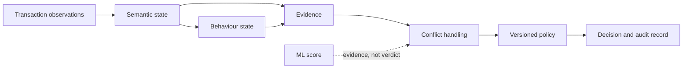

# MicroWorld Semantic Runtimes

Two implementations of an explicit decision pipeline, evaluated in separate
financial domains:

- `aml_runtime` turns transaction observations into an auditable AML decision.
- `ieee_cis_runtime` tests whether the same semantic representation transfers
  to card-fraud detection without using future information.

Classical ML maps a feature vector to a score. These runtimes make the
intermediate state explicit: entities, semantic objects, behaviour, evidence,
conflicts, and the policy that selects the outcome. The experiments test the
representation; they do not assume that it improves every metric.



## Components

| Component | Question | Evaluation |
|---|---|---|
| [AML Decision Runtime](aml_runtime/README.md) | Can a decision be traced from a transaction to ordered policy evidence? | Determinism tests, fixed rule baseline, semantic and behaviour experiments. |
| [IEEE-CIS Transfer Runtime](ieee_cis_runtime/README.md) | Does the representation retain useful signal in a different fraud domain? | Full labelled stream, strict chronological split, Raw / Semantic / Raw + Semantic comparison. |

The components have separate dependencies, data sources, and protocols. Their
metrics are not comparable to each other.

## Architecture

The AML implementation has three compositional layers. Each layer adds state;
none modifies the decision semantics of the layer below it.

| Layer | Responsibility | Output |
|---|---|---|
| Decision runtime | Extract facts, resolve conflicts, apply ordered policy | `ALLOW`, `REVIEW`, `BLOCK`, or `ABSTAIN` with an audit trail |
| Semantic context | Resolve entities and construct typed, confidence-scored objects | Profiles, regimes, relationships, and causal evidence |
| Behaviour | Aggregate time intervals and role transitions | Behaviour and scenario objects projected into evidence |

Rules, extractors, and models contribute evidence. Only the policy engine
selects a decision. A missing input is recorded as a coverage gap, rather than
being treated as a zero-valued feature.

The IEEE-CIS implementation ports the semantic and behaviour representation to
card payments. Its experiment constructs all state causally from the past and
fits categorical vocabularies only on the chronological training prefix.

## Guarantees and controls

| Property | AML runtime | IEEE-CIS experiment |
|---|---|---|
| Decision path | Facts, evidence, conflicts, and policy outcome are retained in the audit record. | Feature construction is available in the standalone runtime. |
| Determinism | Content-addressed identifiers, stable ordering, and a logical clock support replay. | Fixed split, model parameters, seed, and threshold are recorded. |
| Information boundary | Policy only sees supplied evidence. | Evaluation state and category mappings do not use future rows or labels. |
| Verification | Unit tests exercise the decision, semantic, behaviour, and window layers. | Tests cover chronology, no-future-information, and label isolation. |

Detailed contracts and vocabulary definitions are in the
[AML documentation](aml_runtime/docs/README.md) and
[IEEE-CIS transfer analysis](ieee_cis_runtime/docs/fraud_transfer_analysis.md).

## Evaluation

### AML

The frozen rule baseline motivated the semantic layer. On a 100,000-event
horizon, three of ten rules produced all activations; six never fired because
the required source data was absent. The remaining rules exposed fixed
thresholds and sparse-stream novelty as weak decision predicates.

For the Raw / Semantic / Raw + Semantic CatBoost comparison, the combined
feature set had the best recorded values: recall `0.9130`, precision `0.050680`,
F1 `0.096030`, ROC-AUC `0.9846`, and PR-AUC `0.49274`. Semantic-only features
did not replace raw features: their F1 was `0.068997` versus `0.088613` for raw
features. The declared policy also underused the representation: at the same
window CatBoost recall was `0.901`, while policy recall was `0.150`.

Protocols, source constraints, and complete tables are in the
[AML benchmark index](aml_runtime/docs/benchmarks/README.md).

### IEEE-CIS transfer

The transfer experiment uses all 590,540 labelled IEEE-CIS training rows with
a chronological 80/20 split. Raw + Semantic versus Raw changed the held-out
results as follows:

| Metric | Raw | Raw + Semantic | Change |
|---|---:|---:|---:|
| Recall | 0.64198 | 0.67298 | +0.03100 |
| ROC-AUC | 0.78877 | 0.79535 | +0.00658 |
| PR-AUC | 0.17956 | 0.18347 | +0.00390 |
| False positives at threshold 0.50 | 24,944 | 26,727 | +1,783 |

The combined representation improves ranking and recall under this protocol,
but it is not a fixed-threshold operational improvement: precision and F1 both
decrease. The [transfer analysis](ieee_cis_runtime/docs/fraud_transfer_analysis.md)
contains the full protocol, ablations, correlations, and artifact inventory.

## Reproduce

The projects run independently.

```bash
cd aml_runtime
python3 -m venv .venv
.venv/bin/python -m pip install -r requirements.txt
.venv/bin/python -m pytest tests/ -q
.venv/bin/python demo.py
```

```bash
cd ieee_cis_runtime
python3 -m venv .venv
.venv/bin/python -m pip install -r requirements.txt
PYTHONPATH=src .venv/bin/python -m unittest discover -s tests -v
```

The AML demo and tests use bundled sample data. Large AML benchmarks require
IBM AML `HI-Small` at `aml_runtime/data/ibm_aml_data/`. The IEEE-CIS experiment
requires labelled `train_transaction.csv` and `train_identity.csv`; neither
source dataset is included in this repository.

## Limitations

- The AML results are data- and protocol-specific; insufficient history limits
  behavioural coverage, and more history did not monotonically improve quality.
- Semantic features add useful signal in the IEEE-CIS combined model, but the
  semantic-only model trails the raw model on the reported ranking metrics.
- The policy is declarative and inspectable, not learned or threshold-optimised.
- Committed artifacts support review, but a production deployment still needs
  data governance, calibration, monitoring, and domain-specific validation.

## Repository layout

```text
aml_runtime/        AML implementation, documentation, tests, and artifacts
ieee_cis_runtime/   IEEE-CIS implementation, documentation, tests, and artifacts
AUTHORS             Original author information
LICENSE             Apache License 2.0
NOTICE              Copyright and attribution notice
```

## License

Copyright © 2026 Arseniy Abramidze. Licensed under the
[Apache License 2.0](LICENSE). See [NOTICE](NOTICE) and [AUTHORS](AUTHORS).
