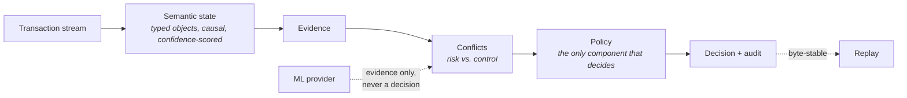
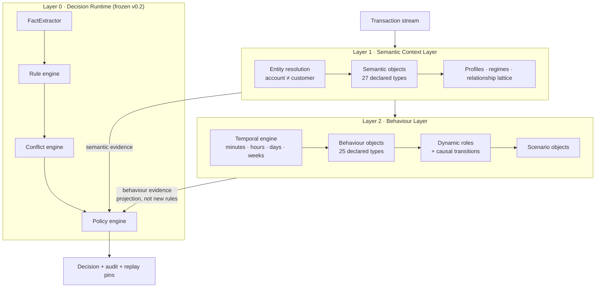
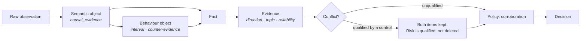

[](LICENSE)
[](tests/)
[](docs/README.md)

# AML Decision Runtime

**A deterministic, auditable transaction-decision runtime, extended with two
composed layers of explicit semantic reasoning — and measured, at every step,
against a frozen ML baseline that is allowed to win.**



> Extracted from the MicroWorld monorepo, where this track shares an idea —
> build the runtime around explicit, inspectable semantic state — with an
> unrelated semantic QA runtime. This repository is self-contained: no
> dependency on that other track.

---

## Core idea

Turn ALLOW / REVIEW / BLOCK / ABSTAIN into something a human can check line by
line, and then measure — rather than assert — whether the layers built to
explain a decision actually change it.

1. **Rules produce evidence; only policy decides.** No extractor, rule, model
   or heuristic returns a decision. One ordered, versioned policy engine
   selects the outcome.
2. **Absence is a fact, not a zero.** Missing inputs become explicit coverage
   gaps that reduce confidence and can force abstention.
3. **Every decision replays.** Content-addressed identifiers, fixed ordering, a
   logical clock. The same input reproduces the same output byte-for-byte.

## Why

An opaque score can be accurate and still be unusable where someone must
justify the outcome. The research question here is whether a runtime built the
other way round — explicit state instead of a hidden score — can be **accurate
enough to be worth its transparency**. Four executed experiments answer that
with measurements, including the ones where the answer is unflattering.

---

## Architecture

Three layers. Each **composes** the one above it; none modifies it.



| Layer | Design doc | Answers |
|---|---|---|
| Decision Runtime | [docs/aml/decision-runtime.md](docs/aml/decision-runtime.md) | What decided this? |
| Semantic Context Layer | [docs/aml/semantic-context-layer.md](docs/aml/semantic-context-layer.md) | What does this transaction *mean*? |
| Behaviour Layer | [docs/aml/behaviour-layer.md](docs/aml/behaviour-layer.md) | What is this account *doing over time*? |

### Evidence flow



Every decision walks back to a raw observation. A model probability is
evidence, never a verdict: it is excluded from the semantic corroboration count
and can only lift an abstention through one declared band policy.

---

## Why deterministic

- **Content-addressed identity.** Object, evidence, conflict and audit ids are
  SHA-256 over the inputs that produced them.
- **Fixed ordering.** Evidence order, policy order and audit key order are
  stable, so a diff between two runs is a real difference.
- **Logical clock.** Wall-clock duration is excluded from replay equality
  because it is not reproducible.
- **Verified, not asserted.** Repeat runs of every benchmark were compared and
  found identical in every metric, census and conflict count.

## Why semantic

The v0.2 measurement motivated the rest of this project. On a 100,000-event
horizon, three of ten rules produced every activation and six never fired:

| Rule | Activations | Claimed | Why it failed |
|---|---:|---|---|
| `AML-R07-BEHAVIOUR` | 93,487 | "abnormal beneficiary behaviour" | novelty is the default state of a sparse stream |
| `AML-R01-LARGE` | 23,772 | "large transfer" | one fixed threshold across nine orders of magnitude |
| `AML-R03-VELOCITY` | 2,323 | "rapid transfers" | absolute count, no per-party baseline |
| six other rules | 0 | SAR, KYC, sanctions, source-of-funds | the source carries none of those feeds |

No threshold repairs a predicate that refers to the wrong thing. The semantic
layer changes what the runtime reasons *about*.

## Comparison with classical ML

Frozen CatBoost, identical protocol, only the feature space varies —
[full analysis](docs/benchmarks/semantic-vs-raw.md):

| Features | Recall | Precision | F1 | FP | FN | ROC | PR |
|----------|-------:|----------:|---:|---:|---:|----:|---:|
| Raw transaction (18) | 0.9012 | 0.046597 | 0.088613 | 4,665 | 25 | 0.9827 | 0.27426 |
| Semantic objects (74) | 0.9012 | 0.035872 | 0.068997 | 6,128 | 25 | 0.9771 | 0.44877 |
| **Raw + Semantic (92)** | **0.9130** | **0.050680** | **0.096030** | **4,327** | **22** | **0.9846** | **0.49274** |

**The semantic layer complements raw features; it does not replace them.** The
union strictly dominates both on all seven metrics. Two counterweights, both
measured: **11 of 74 semantic features are never used** by the model, and given
the same objects at the same window, **CatBoost reaches recall 0.901 where the
declared policy reaches 0.150** — the representation carries signal the policy
does not exploit.

---

## Benchmarks

Full protocols and reproduction commands: **[docs/benchmarks/README.md](docs/benchmarks/README.md)**

Two evaluation sets; results compare only within a set.

**E1** — 100,000 events, 28 laundering labels:

| Arm | TP | FP | Precision | Alert rate |
|---|---:|---:|---:|---:|
| Runtime (frozen v0.2) | 14 | 44,680 | 0.000313 | 44.69% |
| Semantic Runtime | 0 | **382** | — | **0.38%** |
| Semantic Behaviour Runtime | 1 | 2,206 | **0.000453** | 2.21% |

**E2** — 100,000 events, 253 labels, history window varied with the evaluation
set held constant. The frozen runtime is the control and is **invariant to the
event** from 24 h onward:

| History | InsufficientBehaviouralHistory | Recall | Control FP |
|---|---:|---:|---:|
| 5.6 h | 83.77% | 0.0000 | 36,919 |
| **7 d** | 4.10% | **0.1621** | 60,973 |
| 9 d 11 h | **2.98%** | 0.1502 | 60,973 |

68% of laundering events leave `InsufficientBehaviouralHistory` as history
grows. Recall and precision peak at 7 days and decline afterward while
coverage keeps improving — coverage is data-limited, discrimination is not.

## Roadmap

- [ ] Re-derive the corroboration policy — it behaves as a near-constant
      alerting threshold once events carry many signals.
- [ ] Re-specify ML routing — it gates on `ABSTAIN`, which falls from 80.5% to
      4.4% as history grows.
- [ ] Read behaviour from the beneficiary's perspective — roles are computed
      for the originator, so `CollectionBehaviour` never fires.
- [ ] Explain the seven-day peak in decision quality.
- [ ] Replay verification at scale — the pins exist; a harness that
      re-executes a sampled audit stream and asserts byte equality does not.

---

## Repository structure

```text
aml_runtime/
  runtime.py             frozen v0.2 rule runtime — facts, rules, conflicts, policy
  semantic/               Semantic Context Layer — ontology, entities, context, runtime
  behaviour/               Behaviour Layer — temporal engine, objects, roles, scenarios
  *_benchmark.py          the four executed experiments
  window_study.py         history-window scaling study
  semantic_vs_raw.py       raw-vs-semantic ablation with SHAP

docs/
  aml/                    layer design docs and catalogs
  benchmarks/             engineering results, one page per question
  research/               the v0.2 measurement that motivated the semantic layer

tests/                    87 tests
data/amlsim_sample/       tiny fixture used by demo.py and the test suite
artifacts/                committed results from the four experiments
```

`data/ibm_aml_data/` (the IBM AML `HI-Small` source, 5,078,345 transactions,
518,581 accounts) is **not included** — download it separately (Kaggle "IBM
Transactions for Anti Money Laundering") and place it at that path to
reproduce the benchmarks.

## Getting started

```bash
pip install -r requirements.txt   # numpy, scikit-learn, xgboost, lightgbm, catboost, matplotlib
python -m pytest tests/ -q        # 87 tests, no data download required
```

One deterministic decision with its full trace, using the bundled fixture:

```bash
python demo.py
python demo.py --data /path/to/amlsim/output --transaction-id TX-123
dot -Tpng artifacts/aml_graphs/TX-1004.dot -o trace.png   # optional
```

Reproduce the four benchmarks (needs `data/ibm_aml_data/`, see above):

```bash
python -m aml_runtime.semantic_benchmark
python -m aml_runtime.behaviour_benchmark
python -m aml_runtime.window_study
python -m aml_runtime.semantic_vs_raw
```

## Examples

| | |
|---|---|
| [docs/aml/decision-runtime.md](docs/aml/decision-runtime.md#worked-examples) | Three worked decisions: `REVIEW`, `BLOCK`, and a qualified `ALLOW` |
| [artifacts/aml_behaviour_v1/case_studies.md](artifacts/aml_behaviour_v1/case_studies.md) | Every laundering-labelled event with its behaviour, role and scenario objects |

## Documentation

Full index: **[docs/README.md](docs/README.md)**

## Status

**v1 — research implementation, four executed experiments.** It measurably
reduces false positives against the frozen rule-first runtime and measurably
loses recall doing so; its declared policy does not yet exploit the
representation it is given. Both halves are reported, not just the first.

## License

Apache License 2.0. See [LICENSE](LICENSE).
