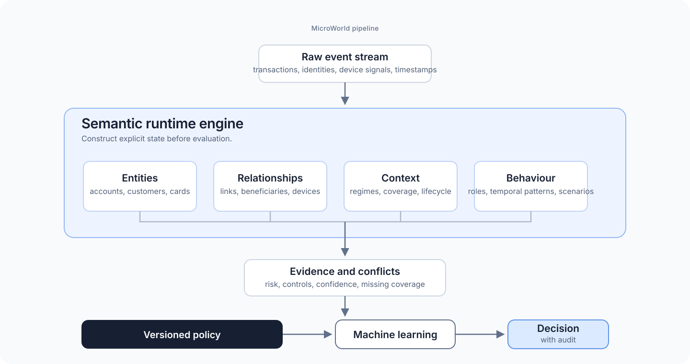
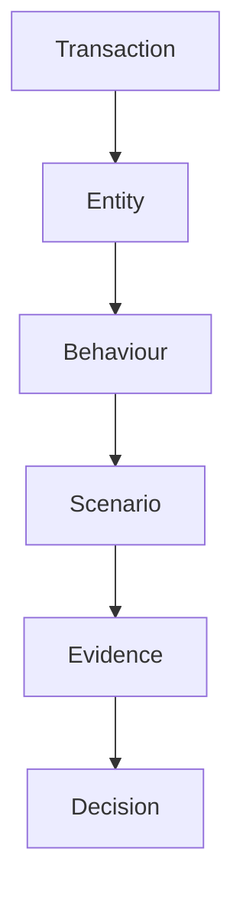
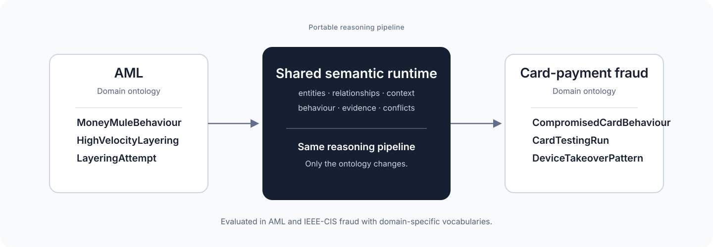

# Semantic Runtime Experiments

*A portable semantic runtime evaluated across multiple financial domains.*

MicroWorld Research Project.



Two implementations evaluate the runtime in distinct domains: AML transaction
monitoring and IEEE-CIS card-payment fraud.

Classical ML learns directly from event vectors.

MicroWorld first constructs an explicit semantic world, then lets a model or a
declared policy reason over it.

> **Semantic runtime**
>
> Deterministic. Replayable. Auditable. Transferable across evaluated domains.

## Why?

Most event-processing systems reason directly over observations.

MicroWorld introduces an explicit semantic layer between observations and
decisions. Instead of asking a model to infer everything from raw events, the
runtime first constructs entities, relationships, behaviour, and evidence. The
decision is then produced over this semantic state.



The runtime keeps every stage available for inspection. Rules and models emit
evidence; the policy is the only component that selects an AML decision.

## Portability

**The runtime is portable. Only the ontology changes.**



`MoneyMuleBehaviour`, `HighVelocityLayering`, and `LayeringAttempt` belong to
the AML ontology. `CompromisedCardBehaviour`, `CardTestingRun`, and
`DeviceTakeoverPattern` belong to the card-fraud ontology. Entity resolution,
temporal behaviour, evidence, conflict handling, and the evaluation pipeline
remain the same.

## Results

> **Best observed results**
>
> - **AML:** recall ↑ 1.18 percentage points, false positives ↓ 338,
>   PR-AUC ↑ 80% with Raw + Semantic features.
> - **IEEE-CIS fraud:** recall ↑ 3.10 percentage points and 126 additional
>   fraud cases detected with the transferred representation.

### AML

An identical CatBoost protocol compares raw transaction features with the
same features augmented by semantic state.

| Configuration | Recall | False positives | PR-AUC | Result |
|---|---:|---:|---:|---|
| Raw CatBoost | 90.12% | 4,665 | 0.27426 | Baseline |
| Semantic only | 90.12% | 6,128 | 0.44877 | Better ranking; lower F1 than raw |
| **Raw + Semantic** | **91.30%** | **4,327** | **0.49274** | **+1.18 pp recall, 338 fewer false positives, PR-AUC +80%** |

The semantic representation complements raw fields; it does not replace them.
Full protocol, ablations, and artifacts: [AML benchmarks](aml_runtime/docs/benchmarks/README.md).

### IEEE-CIS fraud transfer

The same representation was ported to the 590,540-row IEEE-CIS labelled
payment stream. The evaluation uses a strict chronological 80/20 split.

| Configuration | Recall | Fraud cases detected | ROC-AUC | PR-AUC |
|---|---:|---:|---:|---:|
| Raw | 64.20% | 2,609 | 0.78877 | 0.17956 |
| **Raw + Semantic** | **67.30%** | **2,735** | **0.79535** | **0.18347** |
| **Change** | **+3.10 pp** | **+126** | **+0.00658** | **+0.00390** |

At the fixed 0.50 threshold, the combined model also produced 1,783 more
false positives. The result improves ranking and recall; it is not a
threshold-optimised deployment claim. See the complete
[transfer analysis](ieee_cis_runtime/docs/fraud_transfer_analysis.md).

## Architecture

The AML runtime is layered so that new semantic state composes with, rather
than replaces, the decision runtime below it.


The semantic context resolves entities and creates typed objects with causal
evidence. The behaviour layer derives temporal objects, dynamic roles, and
scenarios. The conflict engine preserves both risk and control evidence; it
does not delete one to make room for the other.

> **Runtime controls**
>
> - Content-addressed object, evidence, conflict, and audit identifiers
> - Stable ordering and logical time for byte-stable replay
> - Explicit coverage gaps for absent input
> - Audits that trace a decision back to source observations

The IEEE-CIS implementation uses the same semantic and behaviour concepts as
a causal feature-construction layer. Its tests enforce chronology,
no-future-information, and label isolation.

## Reproduce

The two implementations are independent.

```bash
cd aml_runtime
python3 -m venv .venv
.venv/bin/python -m pip install -r requirements.txt
.venv/bin/python -m pytest tests/ -q
.venv/bin/python demo.py
```

```bash
cd ieee_cis_runtime
python3 -m venv .venv
.venv/bin/python -m pip install -r requirements.txt
PYTHONPATH=src .venv/bin/python -m unittest discover -s tests -v
```

The AML demo and tests use bundled data. Large AML benchmarks require IBM AML
`HI-Small` at `aml_runtime/data/ibm_aml_data/`. The IEEE-CIS experiment requires
labelled `train_transaction.csv` and `train_identity.csv`; neither source
dataset is included.

## Limitations

- The AML results depend on the supplied data and evaluation protocol.
  Behavioural coverage is limited by available history, and more history did
  not monotonically improve quality.
- Semantic-only features trail raw features on AML F1 and IEEE-CIS ranking
  metrics. The measured gains come from the combined representation.
- The AML policy is declared and inspectable, not learned or calibrated for a
  production threshold.
- Production use requires domain validation, calibration, monitoring, and data
  governance beyond the committed experiments.

## Repository layout

```text
aml_runtime/        AML runtime, documentation, tests, and result artifacts
ieee_cis_runtime/   IEEE-CIS transfer runtime, documentation, tests, and artifacts
AUTHORS             Original author information
LICENSE             Apache License 2.0
NOTICE              Copyright and attribution notice
```

## License

Copyright © 2026 Arseniy Abramidze. Licensed under the
[Apache License 2.0](LICENSE). See [NOTICE](NOTICE) and [AUTHORS](AUTHORS).
