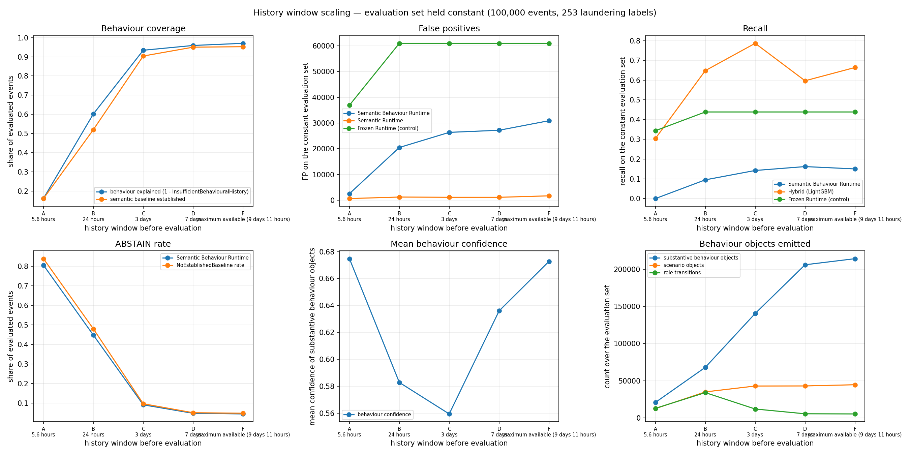

# History window scaling study

aml-window-study/1.0

## Design

The evaluation set is **held constant**: rows 4,977,237–5,077,237 (100,000 events, all of 2022-09-10), with the same 253 laundering labels in every window. Only the priming window in front of it changes.

No reasoning code was modified. none: ontologies, inference rules, projection, conflict pairs, policy engine, routing rule and feature space are identical to the four-arm benchmark

The frozen v0.2 rule runtime is carried as a **control**: it has no behavioural state beyond a 24-hour velocity count, so movement in its numbers would indicate the evaluation set is behaving differently rather than that history is helping.

**Window E (14 days) is unavailable.** The source's dense period spans 2022-09-01 00:00 to 2022-09-10 23:59. Only 9 days 11 hours of history exist in front of the evaluation set, so a 14-day window cannot be constructed. Declared, not approximated.

## Coverage

| Window | Prime rows | Behaviour objects | Scenario objects | Role transitions | Established baselines | Behaviour confidence | NoEstablishedBaseline rate | InsufficientBehaviouralHistory rate | ABSTAIN rate |
|---|---|---|---|---|---|---|---|---|---|
| A — 5.6 hours | 46,109 | 104,635 | 12,512 | 12,890 | 16,124 | 0.6747 | 0.8388 | 0.8377 | 0.8054 |
| B — 24 hours | 441,862 | 107,783 | 34,986 | 34,043 | 52,046 | 0.5829 | 0.4795 | 0.3977 | 0.4474 |
| C — 3 days | 1,489,799 | 147,041 | 42,899 | 12,001 | 90,404 | 0.5595 | 0.0960 | 0.0659 | 0.0903 |
| D — 7 days | 3,001,703 | 210,054 | 43,004 | 5,568 | 95,015 | 0.6360 | 0.0498 | 0.0410 | 0.0469 |
| F — maximum available (9 days 11 hours) | 4,977,237 | 217,124 | 44,635 | 5,367 | 95,263 | 0.6727 | 0.0474 | 0.0298 | 0.0437 |

## Decision quality

| Window | Runtime recall | Runtime precision | Runtime FP | Runtime FN | ML recall | Hybrid recall | Hybrid precision | Hybrid F1 | Control recall | Control FP |
|---|---|---|---|---|---|---|---|---|---|---|
| A — 5.6 hours | 0.0000 | 0.000000 | 2,543 | 253 | 0.6798 | 0.3043 | 0.010153 | 0.019650 | 0.3439 | 36,919 |
| B — 24 hours | 0.0949 | 0.001170 | 20,484 | 229 | 0.6324 | 0.6482 | 0.004819 | 0.009567 | 0.4387 | 60,973 |
| C — 3 days | 0.1423 | 0.001364 | 26,361 | 217 | 0.8617 | 0.7866 | 0.006416 | 0.012728 | 0.4387 | 60,973 |
| D — 7 days | 0.1621 | 0.001506 | 27,182 | 212 | 0.6482 | 0.5968 | 0.005196 | 0.010302 | 0.4387 | 60,973 |
| F — maximum available (9 days 11 hours) | 0.1502 | 0.001229 | 30,892 | 215 | 0.7945 | 0.6640 | 0.004919 | 0.009765 | 0.4387 | 60,973 |

"Runtime" is the Semantic Behaviour Runtime; "ML" is LightGBM alone over the semantic feature space; "Hybrid" is Semantic Behaviour Runtime + LightGBM; "Control" is the frozen v0.2 rule runtime.

## Migration out of InsufficientBehaviouralHistory

| Window | Laundering events | InsufficientBehaviouralHistory | Fully explained behaviour | Moved vs window A | Mean observed events | Mean counterparties |
|---|---|---|---|---|---|---|
| A — 5.6 hours | 253 | 214 | 13 | 0 | 109.5 | 55.9 |
| B — 24 hours | 253 | 150 | 42 | 23 | 510.3 | 213.0 |
| C — 3 days | 253 | 95 | 101 | 73 | 1646.4 | 332.0 |
| D — 7 days | 253 | 81 | 143 | 115 | 3295.9 | 332.8 |
| F — maximum available (9 days 11 hours) | 253 | 43 | 137 | 111 | 4833.6 | 429.7 |

## Evolution plots

