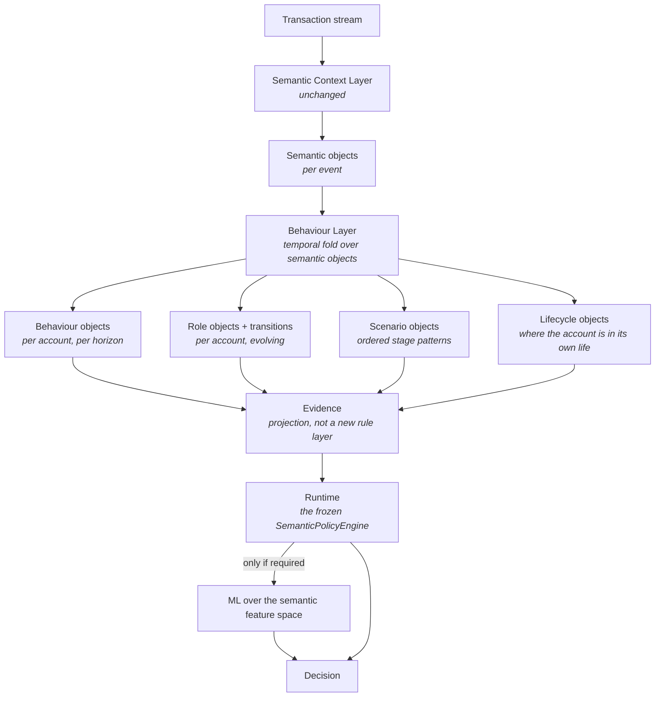
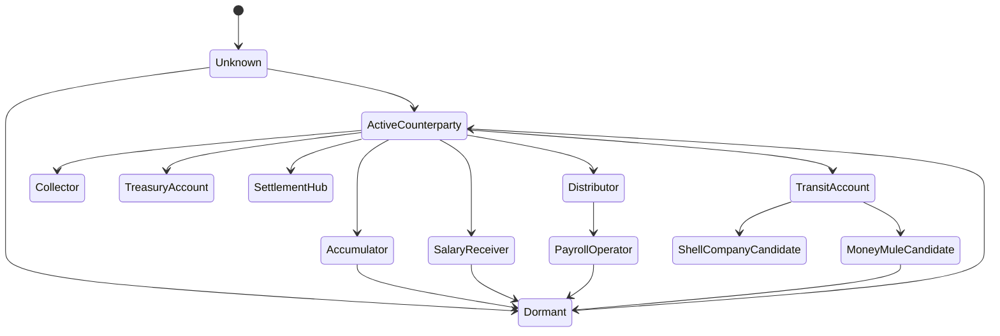
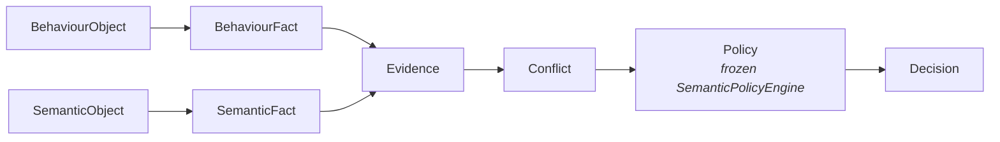

# Semantic Behaviour Layer — Architecture

Status: v1 architecture, implemented in `aml_runtime/behaviour/`.
Builds on [`semantic-context-layer.md`](semantic-context-layer.md).
The Semantic Context Layer is **unchanged**: this layer composes it.

Catalogs: [`catalog-behaviour-objects.md`](catalog-behaviour-objects.md),
[`catalog-scenarios.md`](catalog-scenarios.md),
[`catalog-roles.md`](catalog-roles.md).

| | |
|---|---|
| **Purpose** | Answer *what is this account doing over time* rather than *what happened in this transaction*, by folding semantic objects across declared horizons. |
| **Inputs** | The stream of `SemanticContextResult` objects produced by the Semantic Context Layer, unchanged, plus resolved entity identity. |
| **Outputs** | Behaviour objects, a dynamic role with causal transition records, scenario matches, and a lifecycle object — all projected onto the frozen `Evidence` type. |
| **Guarantees** | Composition, not modification: the Semantic Context Layer, its rule set and `SemanticPolicyEngine` are used unchanged. No new rule vocabulary and no new policy threshold is introduced. Constant memory per account. Counter-evidence is mandatory on every claim. |
| **Limitations** | Day and week horizons are unfillable on the frozen window and are declared so. Roles are computed for the originator, so receive-dominant accounts are under-described. 11 of 25 behaviour types never fired on the evaluation horizon. |


---

## 1. Why an isolated semantic object is not enough

The Semantic Context Layer answers *"what happened in this transaction?"* — and
it answers it well. On the frozen benchmark it removed 99.1% of the rule-first
runtime's false positives. But it left 49,310 of 100,000 events in `ABSTAIN`,
carrying 18 of the 28 laundering-labelled events, all with the identical
reading:

```
NoEstablishedBaseline + UnscaledValue + NonInformativeNovelty
```

Read as one transaction, that reading is correct and final: an account with no
history paid a counterparty it has never used. Nothing more can be said.

Read as a *sequence*, much more can be said. The same account received value
from four distinct sources in eleven minutes and forwarded 97% of it onward in
three payments. No single event in that sequence is remarkable. The sequence is.

The Semantic Context Layer cannot see this, because a semantic object is scoped
to one event. The Behaviour Layer's whole job is to accumulate semantic objects
over time and make claims that only exist at that scale.

---

## 2. Position in the pipeline



### The composition guarantee

`BehaviourDecisionRuntime` holds a `SemanticDecisionRuntime` and calls it. It
does not subclass it, monkey-patch it, or re-implement it. Specifically:

| Component | Status |
|---|---|
| `SemanticContextLayer` | used unchanged |
| `SemanticFactExtractor`, `SemanticRuleEngine` | used unchanged |
| `SemanticPolicyEngine` | used unchanged — same corroboration rule, same thresholds |
| `ConflictEngine` | same class, instantiated with `SEMANTIC_CONFLICT_PAIRS + BEHAVIOUR_CONFLICT_PAIRS` |
| `SEMANTIC_RULES` | untouched; no rule added, removed or re-weighted |

Two design consequences follow, and both were deliberate:

**No new rules.** Behaviour objects reach the policy engine through a
*projection*: each behaviour type declares its own direction, topic and source
reliability in `behaviour/ontology.py`, and `BehaviourEvidenceProjection` copies
those onto an `Evidence` record mechanically. There is no behaviour rule engine,
no second policy family, and no place where a behaviour's meaning is declared
twice.

**No new thresholds in the policy.** The frozen policy asks for two independent
unqualified topics, or one high-concern topic above 0.90. Behaviour topics join
that count. Motif-class behaviours (`CircularMoneyMovement`,
`RapidLayeringBehaviour`, `HighVelocityLayering`) deliberately reuse the
*existing* `network_motif` topic, so they inherit high-concern status without
that policy changing by one character.

---

## 3. The temporal engine

### Horizons

| Horizon | Width | Purpose |
|---|---|---|
| `MINUTES` | 15 min | bursts, prompt forwarding, fan-out inside one sitting |
| `HOURS` | 60 min | sustained shape, regime stability, relationship evolution |
| `DAYS` | 1,440 min | declared; **unfillable on the frozen window** |
| `WEEKS` | 10,080 min | declared; **unfillable on the frozen window** |

The frozen 500,000-event prefix spans 2022-09-01 00:00 to 05:39 — 5.6 hours. Day
and week buckets never accumulate. This is recorded on every `LifecycleObject`
as `horizons_unfillable` and declared in `UNFILLABLE_HORIZONS_ON_SOURCE`, rather
than being silently reported as "no long-term anomaly found". The full source
spans 18 days; a wider prefix is the single change that would populate them.

### Representation

Each horizon is a **tumbling bucket plus its immediate predecessor**:

```
read(horizon) = count[current bucket] + count[previous bucket]   (if adjacent)
                count[current bucket]                            (otherwise)
```

The effective trailing window is between one and two bucket widths. This is
exact, deterministic, order-independent given chronological input, and — the
reason it was chosen — **constant memory per account**. A stream with 327,325
accounts cannot afford per-account event lists; sliding windows over deques cost
~600 bytes per account before a single event is stored. The approximation is
declared in the ontology rather than hidden in the implementation.

### What the engine accumulates

Nothing that is not already a semantic object, plus the arithmetic needed to
compare it:

```
counts        out/in events, self-postings, per horizon
degree        distinct counterparties, derived from FirstContact and
              NonInformativeNovelty objects — the layer never maintains its
              own pair index
value         out/in totals, per-bucket sum and sum-of-squares (for dispersion)
tempo         first/last minute, inter-event gap sum and count
semantics     established-relationship count, cash-inflow count,
              cross-jurisdiction count, stable/broken regime observations
flow          prompt value-preserving forwards, their count and total delay
provenance    who funded this account, and who funded *them* (depth 2)
role          current role, since when, how many transitions
stages        the last six scenario stages, with their minutes
```

`distinct_out` is derived from the *semantic* relationship objects, not from a
pair table. That is the layer's discipline made concrete: behaviour is an
aggregate over meaning.

### Causality

```
observe(t)  reads state built from events 0..t-1        — pure, no writes
commit(t)   folds t into state                          — after observe returns
```

Asserted by test. The layer is constructed without access to the label column;
no behaviour object, role, scenario or lifecycle object can read it.

---

## 4. Behaviour objects

25 declared types across six families — see
[`catalog-behaviour-objects.md`](catalog-behaviour-objects.md) for each one's
predicate, horizon and counter-evidence.

```
shape          DistributionBehaviour  FanOutDistribution  CollectionBehaviour
               FanInCollection  SettlementHubBehaviour
flow           MoneyAccumulationBehaviour  TransitBehaviour  PassThroughBehaviour
               LiquidityBalancingBehaviour  CashConcentrationBehaviour
tempo          BurstActivityBehaviour  HighVelocityLayering
               RapidLayeringBehaviour  DormantAccountActivation
motif          CircularMoneyMovement
relationship   RelationshipGrowthBehaviour  RelationshipCollapseBehaviour
regime         RoutinePayrollBehaviour  PayrollOperatorBehaviour
               SupplierSettlementBehaviour  ExpectedBusinessCycle
               UnexpectedBusinessCycle
composite      MoneyMuleBehaviour  ShellCompanyBehaviour
honesty        InsufficientBehaviouralHistory
```

### The object contract

Every behaviour object carries, without exception:

| Field | Why it is mandatory |
|---|---|
| `type` | closed vocabulary term |
| `confidence` | `prior × support × coverage`, same form as the semantic layer |
| `confidence_explanation` | the arithmetic, in words |
| `interval` | start minute, end minute, horizon — a behaviour without a window is not a behaviour |
| `supporting_semantic_objects` | the object ids this claim aggregates |
| `supporting_entities` | customer, account, jurisdiction |
| `supporting_relationships` | the counterparty edges involved |
| `supporting_observations` | the measured quantities, stated |
| `counter_evidence` | **what argues against this claim** |
| `causal_explanation` | why the observations imply the claim |
| `origin`, `version`, `created_at` | provenance and replay |

**`counter_evidence` is the field that makes these hypotheses rather than
labels.** `DistributionBehaviour` on an account with 12 inbound counterparties
records "12 inbound counterparties are not negligible". `MoneyMuleBehaviour` on
an account observed for 20 minutes records "the account has been observed for 20
minutes, which is short". A claim that cannot state what would weaken it is an
assertion; the ontology does not permit one.

### Confidence

Identical in form to the Semantic Context Layer, so the two vocabularies compose
without recalibration:

```
confidence = prior(type) × n/(n + k_type) × coverage(inputs)
```

`prior` and `k_type` are declared per behaviour type in the ontology and are
*never* fitted. A `DistributionBehaviour` supported by 9 counterparties
(k = 20) is weak; the same claim supported by 400 is strong. This is what lets a
behaviour object be corroborating evidence rather than a switch.

### Honesty

An account below `BEHAVIOUR_MINIMUM_OBSERVATIONS` (6) yields
`InsufficientBehaviouralHistory` **and nothing else** — the behavioural analogue
of `NoEstablishedBaseline`. Four catalog terms that this window cannot support
(`SeasonalBusinessCycle`, `MonthlySalaryCadence`,
`LongTermDormancyReactivation`, `AnnualTaxCycle`) are declared unsupported and
recorded per decision in `withheld`, never emitted.

---

## 5. Roles

Roles are **states an account is in**, not classifications of what it is. The
same account may be `Unknown` at 00:14, `ActiveCounterparty` at 01:30,
`Distributor` at 02:05 and `TransitAccount` at 02:41.



Assignment is a **declared priority order** over the behaviour set, not a
classifier — see [`catalog-roles.md`](catalog-roles.md).
The ordering matters and is declared: a transit reading is never hidden behind a
distribution reading, because an account that both fans out and forwards value
promptly is more informatively described as a conduit.

Two roles are inferred from *another account's* role rather than from the
subject's own behaviour:

- `SalaryReceiver` — the account's funder currently holds `PayrollOperator` or
  `Distributor`, and the account has at most two distinct payers. This is a
  causal inference across the graph, not a label.
- `Dormant` — lifecycle state, when idle exceeds this account's own mean gap by
  the declared multiple.

Every change emits a `RoleTransition` carrying `from_role`, `to_role`,
`at_minute`, `at_event`, `caused_by` (the behaviour object ids that forced it)
and a written explanation. Role tenure and transition count are features of the
account's lifecycle and enter the ML feature space.

---

## 6. Scenarios

A scenario is an **ordered story**, matched as a subsequence over the account's
recent stage history.

Stages are derived per event from the semantic reading plus the temporal state:

| Stage | When |
|---|---|
| `Receive` | pushed onto the beneficiary's history at commit |
| `Settle` | self-posting or intra-customer transfer |
| `Forward` | a prompt value-preserving forward, or a layering segment |
| `Split` | three or more first-time beneficiaries inside the short bucket |
| `Distribute` | a homogeneous payment run this hour |
| `Payments` | any other outbound event |
| `Dormant` | idle beyond the declared dormancy threshold |
| `Hold` | declared; requires a balance model this source does not carry |

Six patterns are declared — see [`catalog-scenarios.md`](catalog-scenarios.md).
Matching is ordered-subsequence over the last six stages, so unrelated activity
between the steps of a story does not break the story.

`ScenarioObject` confidence is `SCENARIO_PRIOR × len(pattern)/(len(pattern)+1)`:
longer patterns are stronger because more had to line up. Risk-class scenarios
carry counter-evidence naming any mitigating behaviour present at the same time.

---

## 7. Evidence flow



Semantic and behavioural evidence enter the *same* conflict engine and the
*same* policy engine, as equals. Two classes of declared conflict exist:

**Behaviour against behaviour.** `TransitBehaviour` versus
`SettlementHubBehaviour`; `BurstActivityBehaviour` versus
`RoutinePayrollBehaviour`; `MoneyAccumulationBehaviour` versus
`ExpectedBusinessCycle`.

**Behaviour against the semantic risk it explains.** This is the point of the
layer. `SEM-R03-INFORMATIVE-NOVELTY` — a counterparty outside the account's
known set — is qualified by `BEH-PayrollOperatorBehaviour`, because novelty is
exactly what a payment operator produces. `SEM-R01-VALUE-REGIME-BREAK` is
qualified by `BEH-ExpectedBusinessCycle`. A single event that looks alarming
usually has an ordinary explanation once the account's behaviour is known, and
the conflict engine is where that explanation is applied — transparently, with
both items preserved in the audit.

`BEH-LiquidityBalancingBehaviour` is declared against `*`: an account whose flow
is internal treasury movement qualifies every risk item raised against it.

---

## 8. Graph model

The context graph gains behavioural nodes. Everything is append-only; role and
behaviour nodes are versioned rather than updated, so the state a past decision
saw remains retrievable.

**New nodes**

| Node | Key |
|---|---|
| `BehaviourObject` | object id (type + subject + causal inputs) |
| `RoleObject` | account + role + since-minute |
| `RoleTransition` | account + from + to + minute |
| `ScenarioObject` | account + scenario + minute |
| `LifecycleObject` | account + event |
| `TimeInterval` | start, end, horizon |

**New edges**

```
BehaviourObject ──aggregates──►      SemanticObject      (many)
BehaviourObject ──about──►           Account
BehaviourObject ──over──►            TimeInterval
BehaviourObject ──contradicts──►     BehaviourObject     (counter-evidence)
RoleObject      ──held_by──►         Account
RoleObject      ──justified_by──►    BehaviourObject
RoleTransition  ──from──►            RoleObject
RoleTransition  ──to──►              RoleObject
RoleTransition  ──caused_by──►       BehaviourObject
ScenarioObject  ──composed_of──►     Stage (ordered)
ScenarioObject  ──supported_by──►    BehaviourObject
BehaviourObject ──projects_to──►     Evidence
Evidence        ──qualifies──►       Evidence            (conflicts)
```

A full explanation path now runs:

```
Decision ← Policy ← Evidence ← BehaviourFact ← BehaviourObject
                                    ↓ aggregates
                              SemanticObject ← causal_evidence ← raw observation
```

---

## 9. Interaction with ML

**The feature space is semantic.** 74 features, none of which is a transaction
column:

| Block | Count | Contents |
|---|---|---|
| Semantic objects | 27 | confidence of each declared semantic type |
| Behaviour objects | 25 | confidence of each declared behaviour type |
| Scenario objects | 6 | confidence of each declared scenario |
| Role objects | 4 | role code, confidence, tenure minutes, transition count |
| Lifecycle objects | 6 | age, idle, events, counterparties, active buckets, horizons filled |
| Evidence state | 6 | risk/mitigation counts, conflicts, unqualified topics, effective risk, strongest risk |

No amount, currency code, bank code, payment format, hour-of-day or account
identifier reaches the model. This is a falsifiable claim about the
representation: if a model can separate laundering from this vector, the
semantic and behavioural vocabularies carry the meaning; if it cannot, the
vocabularies are missing something — and because every feature is a *named
concept*, feature importances say which.

**Routing is unchanged from v1**, deliberately, so the arms stay comparable:

```
route_to_ml(t)  ⟺  behavioural decision is ABSTAIN
                   ∧ no structural semantic explanation present
```

**ML still cannot decide.** The probability enters as `Evidence` with topic
`ml_probability`, is excluded from the semantic corroboration count (a model
score is not an independent semantic topic — §11 of the semantic architecture),
faces the same conflict engine, and can only lift an abstention to `REVIEW`
through the declared `BEH-ML-02` band policy.

---

## 10. Replay model

Behaviour pins extend the semantic pins:

| Pin | Covers |
|---|---|
| *(all semantic pins)* | ontology, inference rules, entity snapshot, context state, semantic object set |
| `behaviour_ontology_hash` | the behaviour vocabulary and all declared constants |
| `behaviour_layer_hash` | the inference implementation version |
| `behaviour_projection_hash` | the behaviour → evidence projection version |
| `behaviour_object_set_hash` | the emitted behaviour object set for this event |
| `role_state_hash` | role, since-minute, transition count at the boundary |

Because the layer is a single-pass causal fold, replaying event *i* requires the
temporal state at *i*, reproducible by replaying `0..i-1`. `role_state_hash` and
`behaviour_object_set_hash` make the shortcut auditable: if a replay produces a
different role or a different object set, the pins diverge before the decision
does.

---

## 11. Audit model

The semantic audit record gains a `behaviour` block:

```json
{
  "behaviour": {
    "ontology_version": "aml-behaviour-ontology/1.0",
    "ontology_hash": "…",
    "layer_version": "aml-behaviour-ontology/1.0+aml-behaviour-inference/1.0",
    "subject_id": "1688:8006E2C50",
    "stage": "Forward",
    "behaviours": [
      {
        "type": "MoneyMuleBehaviour",
        "confidence": 0.36,
        "confidence_explanation": "prior 0.90 x support 0.4000 (n=4, k=6) x coverage 1.00 = 0.360000",
        "interval": {"start_minute": 161, "end_minute": 221, "span_minutes": 60, "horizon": "hours"},
        "supporting_semantic_objects": ["SO-…", "SO-…"],
        "supporting_observations": [
          "4 distinct payers, 4 prompt forwards, retention 0.03",
          "no established counterparty relationship exists"
        ],
        "counter_evidence": ["the account has been observed for 47 minutes, which is short"],
        "causal_explanation": "Collection from several sources, prompt forwarding onward, and no established baseline."
      }
    ],
    "role": {"role": "TransitAccount", "since_minute": 214, "tenure_minutes": 7,
             "transition_count": 2, "previous_role": "ActiveCounterparty"},
    "transition": {"from_role": "ActiveCounterparty", "to_role": "TransitAccount",
                   "caused_by": ["BO-…"], "explanation": "…"},
    "scenarios": [{"type": "CollectThenForward", "matched_stages": ["Receive","Receive","Receive","Forward"]}],
    "lifecycle": {"observed_events": 9, "distinct_counterparties": 5, "age_minutes": 47,
                  "horizons_filled": ["minutes"], "horizons_unfillable": ["days", "weeks"]},
    "withheld": [{"type": "SeasonalBusinessCycle", "missing_inputs": ["multi_season_history"]}]
  },
  "behaviour_rationale": "REVIEW: … Role: TransitAccount. Behaviour: MoneyMuleBehaviour, PassThroughBehaviour. Scenario: CollectThenForward."
}
```

Three properties are non-negotiable, inherited from the semantic layer:

1. **Every behaviour object is reconstructible** from its supporting
   observations, its interval and the pinned state.
2. **Withheld claims are recorded** — what the layer declined to assert, and
   which input it lacked.
3. **Rationales name behaviour and scenario objects.** No rule identifier and no
   transaction field appears in a `behaviour_rationale`.

---

## 12. What "reasoning about behaviour" means operationally

The success criterion in the brief is that the Runtime stop reasoning about
transactions. Concretely, in this implementation:

| Question | Where the answer comes from |
|---|---|
| Is this amount unusual? | the account's own `ValueRegime` (semantic layer) |
| Is this account unusual? | its `BehaviourObject` set over minutes and hours |
| What is this account doing? | its current `RoleObject` |
| What has it been doing? | its `RoleTransition` history and `LifecycleObject` |
| What story is it in? | its `ScenarioObject` matches |
| Why this decision? | `behaviour_rationale`, which names the above and nothing else |

`ABSTAIN` keeps its precise meaning — the state is undetermined — and now has a
second, behavioural way of being resolved: an account with too little
*transactional* history for a value regime may still have enough *behavioural*
history for a mule or transit reading, because `InsufficientBehaviouralHistory`
counts inbound events too. That is the mechanism by which the Behaviour Layer
can recover cases the Semantic Runtime honestly abstained on.

---

## 13. Scope of v1

Implemented: the temporal engine over four declared horizons, 25 behaviour
types, 13 roles with causal transitions, 8 stages, 6 scenarios, the lifecycle
object, the behaviour → evidence projection, 18 declared behavioural conflict
pairs, the 74-dimension semantic feature space, replay pins, the audit block,
and the four-arm benchmark.

Not implemented in v1: persistent graph storage (the context is an in-memory
fold), behaviour object supersession across runs, the `Hold` stage (needs a
balance model), provenance deeper than two hops, and the four catalog terms
declared unsupported on this source.
