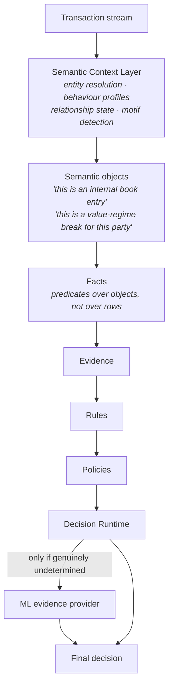
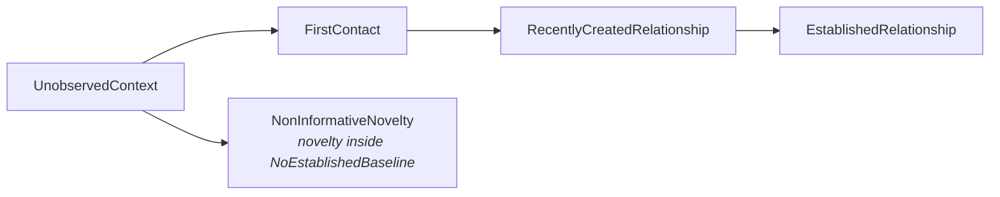
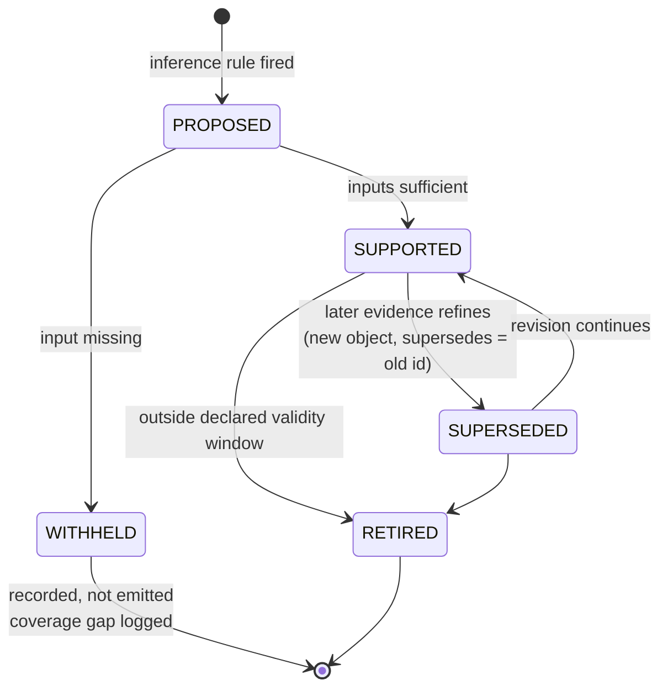
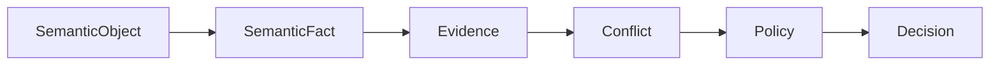

# Semantic Context Layer — Architecture

Status: v1 architecture, implemented as a vertical slice in `aml_runtime/semantic/`.
Supersedes the rule-first framing of [`decision-runtime.md`](decision-runtime.md) (the v0.2 Runtime remains
frozen and is retained as a benchmark arm, not as the target design).

| | |
|---|---|
| **Purpose** | Give the Runtime a vocabulary of meaning — what a transaction *is* — so decisions stop referring to raw column predicates. |
| **Inputs** | The transaction stream, account reference data (customer identity, legal form, booking jurisdiction), and causal history folded from strictly earlier events. |
| **Outputs** | Typed semantic objects with confidence, causal evidence and provenance; withheld claims; coverage gaps; replay pins. |
| **Guarantees** | Causal by construction — `observe` reads only events `0..i-1` and `commit` folds event `i` afterwards. Objects are immutable; revision is supersession. Confidence is declared (`prior x support x coverage`), never fitted. The layer is constructed without access to the label column. |
| **Limitations** | Six ontology terms are declared unsupported on IBM AML `HI-Small` and are never emitted. On a 5.6-hour window 83% of events yield `NoEstablishedBaseline`. Unaided, the layer's recall on that window is zero. |


---

## 1. Why the rule-first architecture stopped

The v0.2 Runtime reasons directly about transactions:

```
Transaction → Facts → Rules → Evidence → Policies → Decision
```

A `Fact` in that pipeline is a predicate over one row of a CSV
(`amount >= 50000`, `no prior payment to this beneficiary`, `>= 3 transfers in
24h`). Measured on the frozen IBM AML benchmark (100,000-event chronological
test horizon, 28 laundering-labelled events):

| Rule | Activations | What it claims to mean |
|---|---|---|
| `AML-R07-BEHAVIOUR` | 93,487 | "abnormal beneficiary behaviour" |
| `AML-R01-LARGE` | 23,772 | "large transfer" |
| `AML-R03-VELOCITY` | 2,323 | "rapid transfers" |
| every other rule | 0 | — |

Alert volume 44,694; TP 14; FP 44,680.

The failure is not calibration. It is **reference**. `AML-R07` claims to detect
abnormal counterparty behaviour, but in a 5.6-hour stream where the median
account sends one payment, "no prior payment to this beneficiary" is the
*default state of the world*, true for 93% of events. The predicate is true and
the claim it encodes is meaningless. Likewise `AML-R01` compares
`amount >= 50000` across rows denominated in different currencies — 0.14 BTC and
50,000 USD enter the same comparison — and across parties whose normal operating
scale differs by nine orders of magnitude (median amount 2,140; p99 35,085,105;
max 140,212,375,027).

No threshold fixes a predicate that refers to the wrong thing. The next version
must change what the Runtime reasons *about*.

---

## 2. Conceptual model

The Semantic Context Layer (SCL) sits between the transaction stream and the
Runtime. It consumes raw events and emits **semantic objects**: typed,
auditable, confidence-carrying assertions about what an event, an account, a
relationship, or a behaviour *is*.



Three invariants define the layer.

**I1 — Reference before magnitude.** No semantic object about magnitude may be
emitted without a resolved *reference frame*: a currency, and a party whose own
observed regime the magnitude is measured against. Absent a reference frame, the
layer emits `UnscaledValue` (an explicit statement of ignorance), never
`LargeTransfer`.

**I2 — Meaning may be negative.** `InternalBookEntry` and
`NonInformativeNovelty` are first-class semantic objects. They assert that a
pattern which would otherwise trip a rule *has an ordinary explanation*. The
rule-first architecture had no vocabulary for "this is a self-posting, there is
no counterparty here" and so was structurally forced to treat 59% of the stream
as inter-party transfers.

**I3 — Absence is a fact, not a zero.** Missing SAR feeds, missing KYC dates,
missing sanctions lists are represented as `CoverageGap` objects that reduce
confidence and can force `ABSTAIN`. They are never silently defaulted to
"clean", and never substituted with a proxy.

---

## 3. Ontology

The ontology is a closed, versioned vocabulary (`SEMANTIC_ONTOLOGY_VERSION`).
Every object type declares its class, its required inputs, its prior confidence,
and the causal window it may read. Nothing outside the vocabulary can be
asserted.

### 3.1 Entity layer

Entities are resolved, not inferred. They come from account reference data and
are stable across the stream.

| Entity type | Source | Meaning |
|---|---|---|
| `Customer` | `Entity ID` in the accounts file | The legal party. Owns ≥1 account. |
| `NaturalPerson` | Entity form `Individual` | A human customer. |
| `Corporation` | Entity form `Corporation` | Incorporated body. |
| `Partnership` | Entity form `Partnership` | Partnership. |
| `SoleProprietorship` | Entity form `Sole Proprietorship` | Owner-operated business. |
| `SovereignEntity` | Entity form `Country` | State/central counterparty. |
| `Account` | `(Bank ID, Account Number)` | A booking location, not a party. |
| `Bank` | `Bank ID` + `Bank Name` | The institution. |
| `Jurisdiction` | Country token parsed from `Bank Name` | Where the booking sits. |
| `VirtualAssetVenue` | Bank name stem `Crytpo Bank` | Crypto venue (sic — dataset spelling). |

The `Account ≠ Customer` distinction is load-bearing. Two accounts of the same
`Entity ID` moving money between them is an `IntraCustomerTransfer`, not a
payment to a new beneficiary. The v0.2 Runtime had no customer concept and could
not express this.

### 3.2 Profile layer

Profiles are *inferred* from causal history and are themselves semantic objects
with confidence. They are the reference frames that I1 requires.

| Profile object | Inferred from | Meaning |
|---|---|---|
| `NoEstablishedBaseline` | `n_prior < baseline_minimum` | Nothing is known about how this party normally behaves. Blocks every regime claim. |
| `ValueRegime` | prior amount distribution, per currency | This party's normal operating scale. |
| `TempoRegime` | prior inter-arrival times | This party's normal transaction tempo. |
| `CounterpartyRegime` | prior distinct counterparties | The relationship set this party normally uses. |
| `DistributionNode` | out-degree ≫ in-degree, sustained | One-to-many payer (payroll/settlement operator shape). |
| `CollectionNode` | in-degree ≫ out-degree, sustained | Many-to-one collector (cash concentration shape). |
| `PassThroughAccount` | inflow ≈ outflow, short retention | Value transits rather than rests. |
| `BookkeepingAccount` | activity dominated by self-postings | Internal accounting location. |

### 3.3 Relationship layer

Relationship state is a lattice, not a boolean. Novelty means something only in
the presence of an established `CounterpartyRegime`.



### 3.4 Event layer

Event objects reinterpret a single transaction given entity + profile +
relationship context.

| Event object | Meaning |
|---|---|
| `InternalBookEntry` | Originator account == beneficiary account. No counterparty exists. |
| `IntraCustomerTransfer` | Different accounts, same `Customer`. Treasury movement. |
| `RoutineValueTransfer` | Within the originator's own `ValueRegime`. |
| `ExpectedHighValueTransfer` | Absolutely large, but ordinary *for this party*. |
| `UnexpectedLargeTransfer` | Materially outside this party's own regime. Requires a baseline. |
| `UnscaledValue` | Magnitude observed with no reference frame. Explicit ignorance. |
| `CrossJurisdictionTransfer` | Booking jurisdictions differ. |
| `VirtualAssetExposure` | One leg sits at a virtual-asset venue. |
| `CurrencyConversionTransfer` | Receiving and payment currency differ. |
| `CashInstrumentSettlement` | Settled in cash. |
| `BehaviourRegimeShift` | Tempo materially outside this party's own `TempoRegime`. |
| `NormalOperationalBurst` | High tempo that matches a `DistributionNode` profile. |
| `LayeringChainSegment` | Value received and forwarded through a `PassThroughAccount` with value preservation inside a short window. |
| `CoverageGap` | A declared input the ontology wants is absent from this dataset. |

The implemented slice declares **26 emittable object types** across the four
layers, all causally supported by data actually present in IBM AML `HI-Small`;
**24 of them were observed** on the evaluation horizon (`CollectionNode` and
`BookkeepingAccount` are the two whose shapes the 5.6-hour window never
produces). A 27th term, `CoverageGap`, is recorded per decision rather than
emitted as an object. Types the
ontology names but the dataset cannot support (`MortgagePayment`, `TaxPayment`,
`DividendDistribution`, `SalaryDistribution`, `DormantRelationshipReactivated`,
`SeasonalBusiness`) are declared in the ontology as **unsupported-on-this-source**
and are never emitted. Fabricating them would violate I3.

---

## 4. Object hierarchy

```
SemanticObject                      (abstract, immutable, hashed identity)
├── SemanticEntity                  Customer, Account, Bank, Jurisdiction
├── SemanticProfile                 ValueRegime, TempoRegime, DistributionNode …
├── SemanticRelationship            relationship-state lattice members
└── SemanticEvent                   per-transaction reinterpretations
```

Every `SemanticObject` carries:

| Field | Purpose |
|---|---|
| `id` | SHA-256 of (type, subject, causal inputs, ontology version). Stable. |
| `type` | Closed-vocabulary ontology term. |
| `subject_id` | Account / customer / relationship / transaction the claim is about. |
| `confidence` | Deterministic, declared — see §7. Never fitted. |
| `confidence_explanation` | The arithmetic, in words. |
| `supporting_facts` | Primitive observations that licensed the claim. |
| `supporting_entities` | Entity IDs the claim depends on. |
| `supporting_relationships` | Relationship IDs the claim depends on. |
| `causal_evidence` | The exact prior-state summary read, with its observation window. |
| `origin` | The inference rule ID that produced it. |
| `version` | Ontology + inference-rule version pair. |
| `created_at` | Logical stream clock (event index + timestamp), not wall clock. |
| `supersedes` | Prior object ID when this is a revision. |

Objects are immutable. Revision is supersession, never mutation, so any decision
can be replayed against the exact object set that produced it.

---

## 5. Lifecycle



`WITHHELD` is the state that enforces I3. When an inference rule wants an input
the source does not carry, the layer records a `CoverageGap` naming the missing
input rather than emitting a low-confidence guess.

Validity windows are declared per type: event objects are valid for exactly one
transaction; relationship objects until the next observation of that pair;
profile objects until the profile's next recomputation.

---

## 6. Inference pipeline

Strictly ordered, single chronological pass, no lookahead:

```
for each transaction t in chronological order:
    1. RESOLVE     entities for both legs (customer, bank, jurisdiction, form)
    2. READ        profile state as of strictly-before t   ← causal boundary
    3. CLASSIFY    event objects (structural: book entry, intra-customer, FX,
                   instrument, jurisdiction)
    4. SITUATE     regime objects (value, tempo) against the profiles from (2)
    5. RELATE      relationship-state object for the (originator, beneficiary) pair
    6. MOTIF       network objects (pass-through, layering segment)
    7. EMIT        the semantic object set for t
    8. COMMIT      update profiles/relationships with t  ← only after emit
```

Step 8 after step 7 is the causal guarantee: no object about `t` may read `t`
itself or anything after it. This mirrors the `CausalFeatureState` discipline
already used by the ML benchmark, and is asserted by tests.

**Forbidden inputs** — enforced structurally, not by convention. The context
builder is constructed without access to the label column; `Is Laundering` is
read into a separate array by the benchmark harness only, after all decisions
are made. No future transaction, no future graph edge, no SAR label, no manual
annotation reaches the layer.

---

## 7. Confidence model

Confidence is **declared and computed**, never fitted. Three factors, multiplied:

```
confidence = prior(type) × support(n) × coverage(inputs)

prior(type)     ontology-declared strength of the claim when fully supported
support(n)      n / (n + k_type)      saturating in the number of causally
                                      observed prior events backing the claim
coverage(i)     |present inputs| / |declared inputs|
```

`k_type` is the ontology's declared half-support point for that object type (the
sample size at which the claim reaches half its prior). Every value is a
constant in `ontology.py`, versioned, and set from the semantics of the claim —
not selected against the label. `confidence_explanation` on each object prints
the three factors and the arithmetic.

Consequences that matter:

- A `ValueRegime` built from 3 events is weak; from 300, strong. The same
  `UnexpectedLargeTransfer` therefore carries different confidence depending on
  how well the party is known — which is exactly the property a fixed 50,000
  threshold lacks.
- Missing inputs reduce confidence rather than being defaulted, so a decision
  taken on partial data is visibly a decision on partial data.

---

## 8. Evidence flow

Semantic objects do not decide. They are the *subjects* of facts.



- A **SemanticFact** is a predicate over a semantic object set:
  `UnexpectedLargeTransfer ∧ ¬IntraCustomerTransfer`. It reuses the existing
  `Fact` dataclass, with `provenance` naming the semantic objects consumed.
- **Evidence** keeps the existing shape (direction, topic, source reliability,
  confidence), so the frozen `ConflictEngine`, `AMLPolicyEngine` and the
  cascade machinery operate unchanged.
- **Mitigating evidence finally exists.** The v0.2 conflict engine has three
  declared conflict pairs and measured a conflict frequency of exactly 0.0 on
  this dataset, because the source carries no controls. Semantic objects supply
  the missing negative pole: `InternalBookEntry`, `IntraCustomerTransfer`,
  `NormalOperationalBurst`, `ExpectedHighValueTransfer` and
  `NonInformativeNovelty` are all *mitigating* evidence with real conflict
  dimensions. The conflict engine stops being decorative.

Every evidence item traces back through fact → semantic object → causal evidence
→ raw observation. This is the success criterion from the brief: a decision is
explainable as *"REVIEW because value left this party's own regime and the
counterparty relationship was informative novelty"*, not as
*"REVIEW because AML-R01 and AML-R07 fired"*.

---

## 9. Graph model

The context graph holds semantics, not only transactions.

**Nodes**

| Node | Key |
|---|---|
| `Customer` | entity id |
| `Account` | bank:account |
| `Bank` | bank id |
| `Jurisdiction` | country token |
| `Transaction` | stream id |
| `BehaviourProfile` | account id + profile type + version |
| `Relationship` | (originator, beneficiary) |
| `SemanticEvent` | object id |
| `Evidence` | evidence id |
| `Policy` | policy id |
| `Decision` | decision id |

**Edges**

```
Account       ──owned_by──►        Customer
Account       ──booked_at──►       Bank ──situated_in──► Jurisdiction
Transaction   ──debits──►          Account
Transaction   ──credits──►         Account
Transaction   ──instantiates──►    SemanticEvent
SemanticEvent ──about──►           Account | Relationship | Customer
SemanticEvent ──grounded_in──►     BehaviourProfile | Relationship
SemanticEvent ──supports──►        Evidence
Evidence      ──qualifies──►       Evidence          (conflicts)
Evidence      ──feeds──►           Policy ──selects──► Decision
Decision      ──supersedes──►      Decision          (replay lineage)
```

The graph is append-only. Profile nodes are versioned rather than updated in
place, so the profile state that a past decision saw is still retrievable.

---

## 10. Interaction with the Runtime

The Runtime is unchanged in structure and remains the only component that
selects a decision. What changes is its input vocabulary.

```
SemanticContextLayer.objects_for(t)
        │
        ▼
SemanticFactExtractor      predicates over objects           (replaces FactExtractor)
        ▼
SemanticRuleEngine         object-type → typed evidence      (replaces AMLRuleEngine)
        ▼
ConflictEngine             unchanged, now actually populated
        ▼
SemanticPolicyEngine       ordered, versioned policies       (semantics of ABSTAIN widened)
        ▼
DecisionRecord + Audit     unchanged shape
```

`ABSTAIN` gains a precise meaning it did not have: *the semantic state is
undetermined* — either `NoEstablishedBaseline` blocks every regime claim, or a
`CoverageGap` removes a required input. Previously `ABSTAIN` meant only "no rule
fired".

## 11. Interaction with ML

ML is demoted to what it should always have been: **an evidence provider of last
resort, invoked only where the semantic state is genuinely undetermined.**

Routing rule (declared, not tuned):

```
route_to_ml(t)  ⟺  semantic decision is ABSTAIN
                   ∧ no structural explanation object present
                     (InternalBookEntry, IntraCustomerTransfer)
```

That is: the model is asked only about events the semantic layer has honestly
admitted it cannot characterise. The returned probability enters as an
`Evidence` object with `topic="ml_probability"`, `source="ML/<model>"`, and
metadata pinning model hash, feature-schema hash and threshold hash. It is
subject to the same conflict engine as any other evidence — a high probability
against an `InternalBookEntry` is *qualified*, not obeyed.

One corollary is load-bearing enough to state as a rule: **a model probability
is not an independent semantic topic.** The corroboration policy of §10 counts
distinct semantic topics, and `ml_probability` is excluded from that count — it
is a scalar over observations the layer has already read, so letting it supply
the second "independent" topic would be double-counting the same evidence. ML
escalates only through its own declared band policy.

ML never selects a decision. The policy engine does.

---

## 12. Replay model

A decision is replayable when the following are pinned and content-addressed:

| Pin | Covers |
|---|---|
| `ontology_hash` | the closed vocabulary + all declared constants |
| `inference_rules_hash` | the ordered inference rule set |
| `entity_snapshot_hash` | the account reference data used for resolution |
| `context_state_hash` | profile/relationship state as of the event boundary |
| `semantic_object_set_hash` | the emitted object set for the event |
| `rules_hash`, `policy_hash` | unchanged from v0.2 |
| `model_hash`, `thresholds_hash`, `feature_schema_hash` | only when ML was routed |
| `input_snapshot_hash` | the raw event |

Replay re-runs the pipeline from the pinned context state and must produce a
byte-identical object set, evidence set, policy outcome list and decision.
Because the layer is a single-pass causal fold, replaying event *i* requires the
state at *i*, which is itself reproducible by replaying `0..i-1`. The context
state hash makes the shortcut auditable.

---

## 13. Audit model

Per decision, the audit record extends the existing canonical JSON with a
`semantic` block:

```json
{
  "semantic": {
    "ontology_version": "...",
    "context_state_hash": "...",
    "objects": [
      {
        "id": "SO-…", "type": "UnexpectedLargeTransfer", "subject_id": "…",
        "confidence": 0.71,
        "confidence_explanation": "prior 0.90 × support 0.86 (n=31, k=5) × coverage 1.00",
        "supporting_facts": ["amount=412000.00 USD", "regime_p95=18400.00 USD"],
        "supporting_entities": ["cust:80062E240", "acct:210:809D86900"],
        "supporting_relationships": ["rel:…"],
        "causal_evidence": {"window": "prior-only", "n_prior": 31, "…": "…"},
        "origin": "SI-VALUE-REGIME/1", "version": "ontology/1+rules/1",
        "created_at": "2022-09-01T02:41:00#417233", "supersedes": null
      }
    ],
    "withheld": [{"type": "SalaryDistribution", "missing_inputs": ["payroll_calendar"]}],
    "coverage_gaps": ["sar_feed", "kyc_dates", "sanctions_list", "customer_declared_activity"]
  }
}
```

Three audit properties are non-negotiable:

1. **Every emitted object is reconstructible** from `causal_evidence` + pinned
   state, without the raw stream.
2. **Withheld objects are recorded.** What the layer *declined* to assert, and
   why, is part of the audit — otherwise silent ignorance is indistinguishable
   from a negative finding.
3. **Explanations are semantic.** The rationale string names object types, not
   rule IDs.

---

## 14. Rule audit: what each existing rule was actually trying to detect

The brief's research task. Every v0.2 rule, the concept behind it, why the
transaction-level encoding fails on this source, and its semantic replacement.

| Rule | Actual concept | Why the encoding fails here | Semantic replacement |
|---|---|---|---|
| `AML-R01-LARGE` | "value is disproportionate to what this party moves" | Fixed 50,000 across mixed currencies (0.14 BTC vs 50,000 USD) and across parties spanning 9 orders of magnitude; fires on 23.8% of events | `ValueRegime` + `RoutineValueTransfer` / `ExpectedHighValueTransfer` / `UnexpectedLargeTransfer` / `UnscaledValue` |
| `AML-R02-JURISDICTION` | "counterparty sits under weak controls" | `country_id` is empty in the IBM transaction schema — the rule never fires at all | `Jurisdiction` resolved from bank reference data → `CrossJurisdictionTransfer`, `HighRiskJurisdictionExposure`, `VirtualAssetExposure` |
| `AML-R03-VELOCITY` | "this party's tempo has changed" | Absolute count ≥3/24h with no baseline; a distribution hub (max 4,351 outbound) is permanently in violation | `TempoRegime` → `BehaviourRegimeShift` vs `NormalOperationalBurst` (mitigating) |
| `AML-R04-SAR` | "known-bad party" | No SAR feed on this source; permanently 0 | `CoverageGap(sar_feed)` — declared absent, never proxied |
| `AML-R05-SAR-CONNECTION` | "contamination through the network" | Same; graph façade returns `None` in streaming mode | `CoverageGap(sar_feed)`; network reasoning kept for `LayeringChainSegment`, which needs no labels |
| `AML-R06-KYC` | "identity assurance has decayed" | No KYC dates on this source; permanently 0 | `CoverageGap(kyc_dates)` |
| `AML-R07-BEHAVIOUR` | "this is not a counterparty this party normally uses" | Novelty is the default state (93.5% of events); the predicate is true and vacuous | Relationship lattice + `NonInformativeNovelty` (mitigating) vs `RecentlyCreatedRelationship` (informative) |
| `AML-R08-SOURCE-FUNDS` | "provenance independently verified" | Absent on this source | `CoverageGap(source_of_funds)` |
| `AML-R09-MANUAL-KYC` | "identity recently re-established" | Absent on this source | `CoverageGap(kyc_dates)` |
| `AML-R10-PAYROLL` | "the burst has a business explanation" | Requires a payroll calendar that does not exist here | `DistributionNode` profile → `NormalOperationalBurst`, inferred from behaviour rather than declared |
| *(no rule existed)* | **"this is not a transfer between parties at all"** | The vocabulary had no way to say it, so 297,555 of 500,000 self-postings were processed as inter-party transfers | `InternalBookEntry`, `IntraCustomerTransfer`, `BookkeepingAccount` |

The last row is the largest single finding of the audit: the concept most needed
on this source was one the rule vocabulary could not express.

---

## 15. Scope of the implemented slice

Implemented (`aml_runtime/semantic/`): the entity layer, the profile layer, the
relationship lattice, the event layer, 21 object types, the confidence model,
the semantic fact/rule/policy engines, the audit block, and the 5-arm benchmark.

Deliberately not implemented in v1: persistent graph storage (the context is an
in-memory causal fold), object supersession across runs, the unsupported
ontology terms of §3.4, and any ML routing beyond the single declared rule of
§11. No threshold in this layer was selected against the evaluation labels; the
benchmark is executed once.
