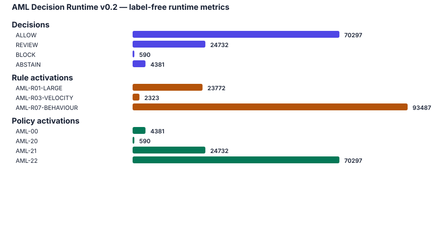

# Deterministic AML Decision Runtime v0.2

## Background

This experiment studies deterministic decision-runtime behaviour, not fraud-detection accuracy. IBM laundering labels are read only after each decision for exploratory evaluation; they never enter facts, evidence, conflicts, policies, decisions, graph state, or audits.

## Architecture

The architecture remains `Transaction → Facts → Evidence → Conflicts → Policies → Decision → Audit`. v0.2 adds evidence-quality metadata, declared semantic conflicts, configurable policy thresholds, and label-free measurement without adding machine learning.

## Dataset

`data/ibm_aml_data/HI-Small_Trans.csv` contained 5,078,345 validated rows and 0 rejected rows. The causal sample contains 100,000 transactions from 2022-09-01T00:00:00 to 2022-09-01T00:09:00 across 105,585 accounts.

The public schema omits independent SAR, KYC, jurisdiction, sanctions, and control evidence. v0.2 does not manufacture those attributes.

## Runtime and decision flow

An isolated new-beneficiary signal is low-severity evidence and can be allowed. Review requires noisy-OR effective risk of at least 0.90 or a designated single high-concern rule. Block requires unqualified SAR evidence or the independently corroborated large-value, velocity, and behavioural combination at effective risk of at least 0.995. These frozen defaults are not label-fitted.

## Decision and evidence metrics

| Decision | Count |
|---|---|
| ALLOW | 70297 |
| REVIEW | 24732 |
| BLOCK | 590 |
| ABSTAIN | 4381 |

| Metric | Value |
|---|---|
| Evidence entropy (rule distribution, bits) | 0.851432 |
| Evidence-count entropy (bits) | 1.06641 |
| Average evidence count | 1.19582 |
| Conflict frequency per transaction | 0.0 |
| Average decision depth | 3.39164 |
| Average evidence-graph nodes | 5.39164 |
| Average evidence-graph edges | 3.58746 |
| Average audit size (bytes) | 4430.82099 |

## Rule analysis

Contribution is observational co-occurrence of evidence with the final decision, not causal attribution.

| Rule | Activations | ALLOW | REVIEW | BLOCK | ABSTAIN | Mean confidence |
|---|---|---|---|---|---|---|
| AML-R01-LARGE | 23772 | 0 | 23182 | 590 | 0 | 0.91 |
| AML-R02-JURISDICTION | 0 | 0 | 0 | 0 | 0 | 0.0 |
| AML-R03-VELOCITY | 2323 | 0 | 1733 | 590 | 0 | 0.88 |
| AML-R04-SAR | 0 | 0 | 0 | 0 | 0 | 0.0 |
| AML-R05-SAR-CONNECTION | 0 | 0 | 0 | 0 | 0 | 0.0 |
| AML-R06-KYC | 0 | 0 | 0 | 0 | 0 | 0.0 |
| AML-R07-BEHAVIOUR | 93487 | 70297 | 22600 | 590 | 0 | 0.84 |
| AML-R08-SOURCE-FUNDS | 0 | 0 | 0 | 0 | 0 | 0.0 |
| AML-R09-MANUAL-KYC | 0 | 0 | 0 | 0 | 0 | 0.0 |
| AML-R10-PAYROLL | 0 | 0 | 0 | 0 | 0 | 0.0 |

### Rule interactions

| Rule A | Rule B | Coactivations |
|---|---|---|
| AML-R01-LARGE | AML-R07-BEHAVIOUR | 22013 |
| AML-R03-VELOCITY | AML-R07-BEHAVIOUR | 1767 |
| AML-R01-LARGE | AML-R03-VELOCITY | 773 |

## Policy analysis

| Policy | Triggered |
|---|---|
| AML-00 | 4381 |
| AML-20 | 590 |
| AML-21 | 24732 |
| AML-22 | 70297 |

Every policy audit stores effective risk, qualified/unqualified risk counts, and the configured review/block thresholds.

## Conflict analysis

Conflicts are first-class positive-versus-negative evidence objects. They carry confidence and source-reliability values plus dimensions for confidence asymmetry, source-strength asymmetry, and old-versus-recent supersession when applicable. Absence of a control in the IBM schema is reported as missing data coverage rather than treated as a contradiction.

| Conflict metric | Value |
|---|---|
| Conflicts by kind | {} |
| Conflict dimensions | {} |

## Benchmark

| Metric | Measured value |
|---|---|
| Scan and chronological selection | 17.195 s |
| Decision loop | 26.978 s |
| End to end | 44.744 s |
| Mean latency | 0.250 ms |
| p95 latency | 0.340 ms |
| Peak memory | 271,695,872 bytes |

## Limitations

This is not an AML effectiveness study. The sample is an early ten-minute causal window; rule confidence is an explicit policy parameter, not a calibrated probability; and contribution is association, not intervention. Per-transaction JSON audits are also a deliberate transparency/storage tradeoff.

## Future work

Evaluate frozen configurations on later chronological windows and other datasets; attach independently sourced KYC, jurisdiction, SAR, and control feeds; compare policy changes through controlled ablations; and add counterfactual contribution analysis without consulting laundering labels.
